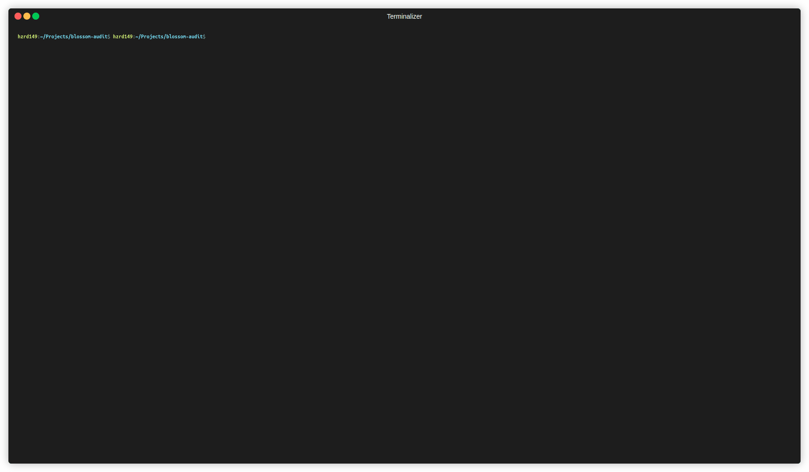

# Blossom Server Audit

A simple cli tool for auditing [blossom](https://github.com/hzrd149/blossom) servers

Command [documentation](./docs)

## Installation

This tool requires nodejs >= 20 which can be downloaded [here](https://nodejs.org/en/download)

Once node is downloaded you can either run it with `npx` or install it with `npm`

```sh
# Run temporarily
npx run blossom-audit

# install globally
npm install -g blossom-audit
```

## Usage

Look at the [documentation](./docs) for a full list of commands

A few example uses

```sh
# Run a full upload / download audit on the blossom.example.com server with the bitcoin whitepaper pdf
npx blossom-audit audit https://blossom.example.com bitcoin

# Run a full audit with authentication support
npx blossom-audit audit https://blossom.example.com bitcoin --sec nsec1...
```

## Demo


